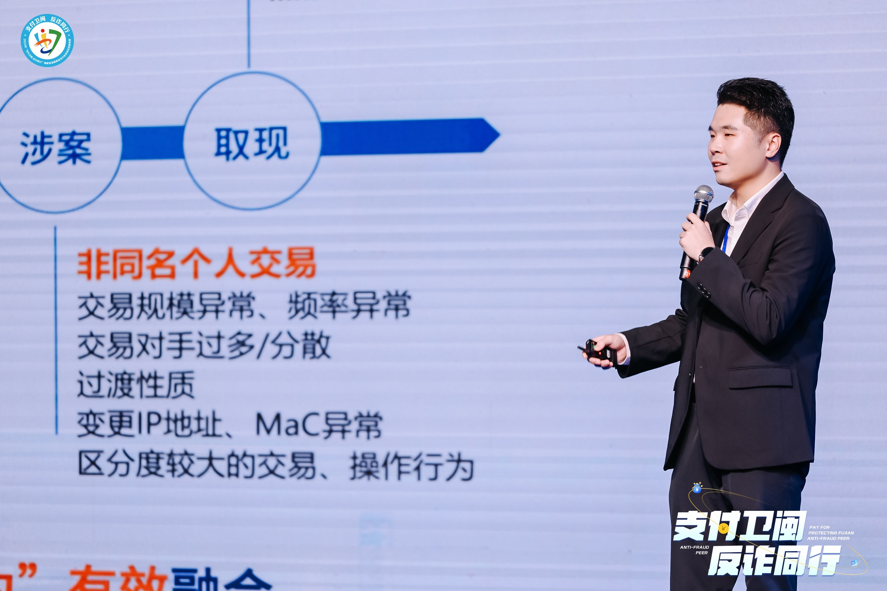

&emsp; I am currently a business analyst and mainly engaged in anti-fraud work in the Security Department, Industrial Bank Head Office, Fuzhou, China. I am recommended for admission to Xiamen University in 2019 and received my master's degree in 2022. I am also the member of Key Laboratory of Underwater AcousticCommunication and Marine InformationTechnology, Xiamen University.

Research Interests
======
My research interests are mainly in anti-fraud rule model, machine learning, image processing and anomaly detection.

Major Awards
======
* Second Prize in Algorithm Competition of Fujian Financial System Payment Business Knowledge and Skills Competition, 2024.
* Third prize of Industrial Bank Case Competition, 2023.
* Outstanding Graduates of Xiamen University, 2022.
* National Scholarship(Master), 2021.
* Three Good Students of Xiamen University, 2021.
* National Third Prize of China Graduate Artificial Intelligence Innovation Competition, 2021.
* Huawei Scholarship of Xiamen University, 2020.
* National Second Prize and Best Paper Award of China Graduate Electronic Design Competition, 2020.

Academic Papers
======
<b>1. A Video System Based on Convolutional Autoencoder for Drowning Detection</b> 
 
<i>Neural Computing and Applications</i>, 2022.

<b>2. A Video Drowning Detection Device Based on Underwater Computer Vision</b> 

<i>IET Image Processing</i>, 2022.
  
<b>3. Drowning Detection Based on Video Anomaly Detection</b> 

<i>International Conference on Image and Graphics</i>, 2021.
  
Patents
=====
<b>1. 基于无监督异常检测的溺水检测方法及装置</b>, 2021.09.
  
<b>2. 游泳者溺水检测方法</b>, 2021.03.
  
<b>3. 水下自拍系统</b>, 2020.09.
 
 
 
Email: hexinyu@cib.com.cn
